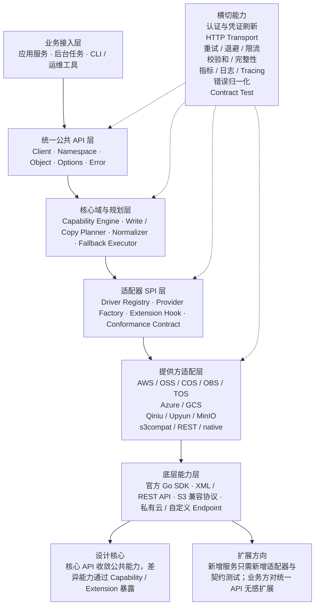
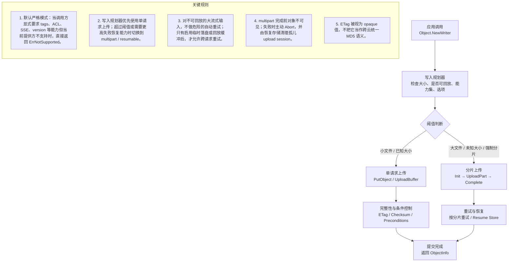

*REQUIREMENTS & DETAILED DESIGN*

# 通用对象存储客户端

**需求与详细设计**

> 面向 Golang 的多云对象存储统一接入层设计，覆盖统一 API、能力探测、传输管理、错误模型与 Provider 可扩展机制。

| 项目 | 内容 | 项目 | 内容 |
| --- | --- | --- | --- |
| 文档版本 | v1.0 | 文档日期 | 2026-04-09 |
| 适用语言 | Go（建议 1.22+） | 文档性质 | 需求 + 详细设计 |
| 目标形态 | 通用 SDK / Library | 设计原则 | 统一抽象、显式能力、可扩展 |
| 首批支持 | 阿里云、腾讯云、华为云、火山云、AWS、GCP、Azure、七牛云、又拍云、MinIO | 默认策略 | Native Driver 优先，兼容驱动可选 |

> **执行摘要**
> - 本方案不是简单做“最低公分母封装”，而是在统一 API 之上引入 Capability Report、Transfer Manager、Native Extension 与 Provider SPI，兼顾抽象稳定性和高级能力可扩展性。
> - 统一模型采用“账户/租户（可选） → Bucket → Object”的分层；Bucket、Object、VersionID、Metadata、Checksum、Signed URL、Multipart Upload 被定义为一等公民。
> - 对差异较大的能力（如 Azure SAS、GCS Signed URL 凭证约束、Qiniu Upload Token、Upyun FORM/签名认证、ACL/Policy、Lifecycle、媒体处理等）采用“可选统一 + Provider 扩展”的设计，而不是强行抽象成错误语义。

| 章节 | 内容 |
| --- | --- |
| 1 | 背景、目标与范围 |
| 2 | 需求分析（功能、非功能、约束与非目标） |
| 3 | 总体方案（架构、抽象模型、适配策略） |
| 4 | 详细设计（接口、配置、能力集、鉴权、传输、错误、可观测性、安全、测试） |
| 5 | 实施路线、风险与扩展计划 |
| 附录 | Provider 对照、建议目录结构、官方参考资料 |

## 1. 背景、目标与范围

对象存储已经成为业务系统中的基础设施能力，但不同云厂商在术语体系、鉴权模型、SDK 风格、错误码、签名机制、分片上传约束、列表分页语义以及高级能力暴露方式上均存在差异。业务方如果直接耦合各家 SDK，通常会遇到以下问题：接入成本高、迁移成本高、测试成本高、能力边界不清晰、代码中充满 if provider == ... 的分支。

本设计的目标，是在 Go 语言下构建一个可面向多云/混合云统一使用的对象存储客户端，使业务层只依赖一套稳定 API 即可完成大多数数据平面操作；同时保留对 Provider 差异化能力的扩展入口，避免抽象层变成新的锁定点。

### 1.1 设计目标

- 统一数据平面 API：Bucket、Object、List、Range Read、Multipart、Signed URL 等核心操作保持一致。
- 显式能力模型：不假设所有 Provider 都支持同样的能力，所有可选能力都通过 Capability Report 暴露。
- 可扩展的 Provider SPI：新增厂商时尽量不修改 core 包，只新增 driver 与 mapping。
- 对业务友好的错误模型：把 Provider 原始错误翻译成统一错误码，并保留 request id、http status、provider code 等诊断信息。
- 传输能力内聚：把自动分片、并发上传/下载、断点续传、状态持久化、校验、进度回调放入 Transfer Manager，而非散落在业务代码。
- Native Extension 逃生口：对无法合理抽象的高级能力，通过 As(target) / Extension 获取底层 SDK 或 provider-specific client。

### 1.2 设计范围

首批纳入统一抽象和适配器设计的服务如下。所有服务默认优先采用官方原生 SDK / 官方推荐访问方式实现 native driver；若某服务同时提供稳定的兼容协议（如 S3-compatible），可在后续增加 compat driver，但不替代 native driver。

| Provider | 统一命名 | 建议驱动策略 | 说明 |
| --- | --- | --- | --- |
| Alibaba Cloud OSS | alibaba | Native Driver | 桶/对象模型；使用 OSS Go SDK。 |
| Tencent Cloud COS | tencent | Native Driver | 桶/对象模型；签名 URL 与上传下载能力齐全。 |
| Huawei Cloud OBS | huawei | Native Driver | 桶/对象模型；支持签名 URL 与分段能力。 |
| Volcengine TOS | volcengine | Native Driver | 桶/对象模型；目录语义通过 prefix/delimiter 模拟。 |
| AWS S3 | aws | Native Driver + 可共享 S3 Common | S3 语义作为一类重要参考，但不等价于整体抽象。 |
| Google Cloud Storage | gcs | Native Driver | 原生 bucket/object 模型；签名 URL 与认证约束需单独处理。 |
| Azure Blob Storage | azure | Native Driver | Account / Container / Blob 三层；Container 映射为统一 Bucket。 |
| Qiniu Kodo | qiniu | Native Driver | 上传/下载/管理凭证模型特殊；直传授权建议单独扩展。 |
| Upyun USS | upyun | Native Driver / REST | REST + FORM + 签名/基本认证；保留目录体验，但核心仍按对象模型处理。 |
| MinIO | minio | Native Driver 或 S3 Compat Driver | 自托管优先；自定义 endpoint、path-style、私有 CA 是一等公民。 |

### 1.3 明确不在 v1 统一抽象中的内容

- CDN 域名管理、加速域签名、回源、刷新、预热等 CDN 面能力。
- 图片/音视频处理、内容识别、媒体转码、数据处理流水线等厂商差异极大的增值能力。
- Bucket 生命周期策略、跨区域复制、对象锁、法律保留、Inventory、事件通知等偏管理平面的能力。
- 跨 Provider 的服务端 Copy 保证。跨云复制默认降级为“读 + 写”的流式拷贝 helper，而不是 core API 的强语义承诺。
- 对象“目录”作为一等实体。目录在大多数对象存储中只是 prefix 视图，因此 v1 不提供真实目录抽象。

> **关键设计决策**
> - 统一 API 只抽象“稳定且广泛存在”的数据平面能力；高级能力通过 capability gating 或 extension 暴露。
> - ETag 不等于 MD5，不在统一 API 中承诺任何散列语义；Checksum 采用独立结构表达。
> - Rename/Move 不设为核心原语。默认 helper 语义为 Copy + Delete；如果某 Provider 支持原生 rename/move，则通过 extension 暴露。

## 2. 需求分析

需求分为功能需求、非功能需求、约束条件与外部接口要求四类。优先级采用 P0 / P1 / P2：P0 表示 v1 必须具备；P1 表示建议在 v1 完成；P2 表示预留设计、可在后续版本实现。

### 2.1 典型使用场景

| 场景 | 说明 | 关键诉求 |
| --- | --- | --- |
| 业务服务上传/下载对象 | 应用服务读写用户文件、模型文件、构建产物、媒体资源等。 | 统一 Put/Get、Metadata、Content-Type、重试与错误映射。 |
| 多云部署 | 同一业务在不同客户环境/区域采用不同 Provider。 | 同一代码路径接入多家对象存储。 |
| 混合云与私有化 | 公有云 + MinIO / 私有对象存储并存。 | 自定义 endpoint、path-style、私网证书、凭证灵活配置。 |
| 浏览器/客户端直传 | 服务端生成临时访问授权，由客户端直接上传/下载。 | Signed URL / SAS / 临时授权扩展。 |
| 大文件传输 | 几 GB 到 TB 级大文件上传、下载、断点续传。 | 自动分片、并发、进度、校验、状态恢复。 |
| 统一可观测性 | 平台团队需要统一看不同云对象存储的调用质量。 | 标准化 metrics、trace、日志字段。 |

### 2.2 功能需求

| ID | 需求 | 优先级 | 备注 |
| --- | --- | --- | --- |
| FR-001 | 按 Provider 与配置实例化客户端，并支持 registry/factory 模式动态注册 driver。 | P0 | 为扩展新云厂商提供标准入口。 |
| FR-002 | 支持 region、endpoint、bucket 定位，以及 path-style / virtual-host / 自定义域名等寻址参数。 | P0 | 兼容公有云、私有云与 VPC endpoint。 |
| FR-003 | 支持静态 AK/SK、临时凭证、环境变量、文件配置、自定义 provider 等鉴权来源，并具备刷新能力。 | P0 | 避免凭证散落在业务代码。 |
| FR-004 | 支持 Bucket 的 Create / Delete / Stat / List。 | P0 | Create 能力受 provider 与权限影响，需 capability 化。 |
| FR-005 | 支持对象 Put / Get / Head / Delete / Exists。 | P0 | Get 必须支持流式读取。 |
| FR-006 | 支持按 prefix、delimiter、continuation token 的对象列表查询。 | P0 | 统一分页输出与 CommonPrefixes。 |
| FR-007 | 支持 Range Read、If-Match / If-None-Match / If-Modified-Since 等条件读取。 | P1 | 便于缓存协商和断点下载。 |
| FR-008 | 支持 Content-Type、Cache-Control、Content-Disposition、用户元数据等常用头和元数据写入/读取。 | P0 | 元数据 key 大小写与原始头需规范化。 |
| FR-009 | 支持对象 Copy、批量 Delete、同 Bucket / 跨 Bucket（同 Provider）复制。 | P1 | 批量 Delete 需要自动分批与部分失败回报。 |
| FR-010 | 支持生成临时访问授权：优先统一为 Signed URL；对非 URL 型直传机制预留 Direct Grant 扩展。 | P1 | 适配 Azure SAS、Qiniu Upload Token、Upyun FORM 等。 |
| FR-011 | 支持自动分片/多段上传，必要时支持断点续传状态恢复。 | P0 | 由 Transfer Manager 统一编排。 |
| FR-012 | 支持下载到流或文件，并可按能力启用并发 Range 下载。 | P1 | 对大文件下载尤其重要。 |
| FR-013 | 支持统一 Capability Report 查询，并给出 supported / conditional / extension-only / unsupported。 | P0 | 避免“运行时才发现不支持”。 |
| FR-014 | 支持统一错误类型、统一错误码、request id、provider code、http status、是否可重试等诊断信息。 | P0 | 便于业务兜底和平台观测。 |
| FR-015 | 支持统一日志、指标、Trace 注入。 | P0 | 便于平台治理。 |
| FR-016 | 支持 Native Extension / As(target) 获取底层 SDK client。 | P0 | 解决抽象边界问题。 |
| FR-017 | 支持 contract test + provider test 套件，以统一验证各 driver 语义。 | P0 | 保证新增厂商接入质量。 |
| FR-018 | 支持可配置的 retry、timeout、proxy、TLS、custom CA、user-agent。 | P0 | 适应企业网络与审计要求。 |

### 2.3 非功能需求

| ID | 类别 | 要求 |
| --- | --- | --- |
| NFR-001 | API 稳定性 | 核心接口按语义版本管理；新增 provider 不破坏已有调用方式。 |
| NFR-002 | 并发安全 | 客户端实例应支持多 goroutine 并发使用，避免共享可变全局状态。 |
| NFR-003 | 内存效率 | 优先流式读写；对未知长度流按策略缓冲或落盘，不默认全量入内存。 |
| NFR-004 | 可观测性 | 统一输出请求耗时、重试次数、错误分类、字节量、provider/op 标签。 |
| NFR-005 | 安全性 | 默认启用 TLS 校验，不记录密钥、完整签名 URL、Authorization、SAS token 等敏感数据。 |
| NFR-006 | 可扩展性 | 新增 driver 时，理论上只需新增 provider 包、mapping、测试与文档。 |
| NFR-007 | 可测试性 | 支持本地 MinIO 快速回归 + 云上 nightly smoke test。 |
| NFR-008 | 可维护性 | core 不直接依赖所有 driver，避免无关依赖膨胀和初始化副作用。 |
| NFR-009 | 可移植性 | 支持 Linux / macOS / Windows；不依赖 Go plugin 作为核心扩展机制。 |
| NFR-010 | 性能 | 大文件场景下应支持并发分片与下载；默认参数可配置、可观测、可限流。 |

### 2.4 约束与设计假设

- 不同 Provider 的 Bucket 创建参数、区域模型、存储类型和权限模型不完全一致，因此 Bucket 管理只统一最小公共能力，复杂选项通过 driver config 或 extension 下放。
- 对象键（object key）按“完全不透明字符串”处理，不做 path.Clean、不自动去除前导斜线、不假设 UTF-8 之外的编码修正，以免破坏原始语义。
- 部分 Provider/SDK 要求上传时给出 Content-Length；对于未知长度流，Transfer Manager 允许“内存缓冲 / 临时文件 / 报错”三种策略。
- Signed URL 与 Direct Upload 机制在不同 Provider 上差异较大，因此 v1 对其采用“统一能力 + 扩展模式”的折中设计。
- 对一致性模型不做跨 Provider 强承诺；调用方应以 Read-After-Write 最佳实践与重试策略来适配厂商差异。

> **统一能力分层**
> - Core Unified：Bucket/Object 基础 CRUD、List、Metadata、Range Read、Multipart、Signed URL（URL 型）
> - Optional Unified：Tagging、Versioning、KMS/Provider-managed encryption、Batch Delete、Conditional Operations
> - Extension Only：Lifecycle、Replication、Object Lock、Inventory、Website、Media/Image Processing、CDN Domain、Qiniu Upload Token / Upyun FORM 等

## 3. 总体方案

总体方案采用“Core + Driver + Transfer + Middleware + Extension”的分层结构。Core 负责统一抽象、类型定义、能力模型、错误模型与 registry；Driver 负责把统一请求翻译成各 Provider 的原生调用；Transfer 负责大文件与断点续传；Middleware 负责日志、指标、Trace、TLS、proxy 与公共 HTTP 配置；Extension 用于安全地暴露厂商特有能力。

### 3.1 设计原则

1. 抽象优先于兼容，但不做错误抽象。只有语义稳定且跨 Provider 常见的能力才进入 core。
2. Capability first。在执行可选能力之前，优先通过 Capability Report 做静态/动态判定。
3. Stream first。Put/Get 一律以流式接口为中心，文件便捷接口下沉到 transfer 包。
4. Config explicit。endpoint、region、credential、retry、transport、driver config 等都通过显式配置输入，不依赖隐藏全局状态。
5. Native-friendly。保持统一 API 的同时，提供 As(target) 和 provider extension，允许高级场景直接访问底层 SDK。

### 3.2 逻辑架构



*图：统一对象存储客户端总体架构*

| 层次 | 职责 |
| --- | --- |
| 业务层 / 应用服务 | 仅依赖统一 SDK；不感知具体云厂商 SDK。 |
| Core Facade | Client、BucketService、ObjectService、MultipartService、Signer、CapabilityReporter。 |
| Transfer & Common Services | Transfer Manager、State Store、Checksum、Retry Policy、Region/Endpoint Resolver、Error Translator。 |
| Provider SPI | Factory、DriverConfig、Error Mapping、Capability Mapping、Request/Response Adapter。 |
| Provider Drivers | aws / alibaba / tencent / huawei / volcengine / gcs / azure / qiniu / upyun / minio。 |
| Official SDK / REST API | 最终与各厂商官方 SDK 或官方 REST 协议交互。 |

### 3.3 统一抽象模型

| 对象 | 统一定义 |
| --- | --- |
| Account / Tenant（可选） | 对 Azure、GCS 等存在账户/项目层概念的 Provider，通过 driver config 持有，不强行提升到所有 Provider 的公共字段。 |
| Bucket | 统一的命名空间实体；Azure Container、Upyun 服务空间、Qiniu 空间都映射到 Bucket 抽象。 |
| Object | 以 key 标识的数据对象；key 被视为不透明字符串。 |
| VersionID | 对象版本的统一占位字段，语义为 opaque string；仅在 provider 支持并启用版本化时有效。 |
| Metadata | 分为系统头（Content-Type 等）与用户自定义元数据；统一 API 返回规范化后的键值。 |
| Checksum | 独立于 ETag 的校验信息结构，用于表达 MD5、CRC32C、CRC64、SHA1 等。 |
| Capability | 表达某 driver/配置/凭证在当前上下文下可否执行某能力。 |

### 3.4 Native Driver 优先、兼容驱动可选

尽管一些服务对外提供 S3-compatible 接口或与 S3 相近的语义，设计上仍然建议把“官方原生 SDK / 官方推荐协议”作为默认驱动实现路径。原因有三：

- 原生 SDK 在签名、重试、endpoint 解析、错误码与高级能力上更完整，能更准确地表达 provider 语义。
- 兼容协议通常覆盖的是公共子集，容易在 Metadata、ACL、签名 URL、存储类型、错误码与分页语义上出现细微不一致。
- compat driver 更适合特定私有化场景或性能/依赖优化场景，应由调用方明确选择，而不是默认替代 native driver。

> **关于目录与重命名**
> - 目录：统一 API 仅提供 prefix + delimiter 的列表语义，目录标记对象（如零字节 / 结尾为 / 的对象）只作为 provider-specific helper 处理。
> - 重命名：默认 helper 语义是 Copy + Delete，不承诺原子性；某些 Provider 若具备原生 move/rename 能力，可通过 extension 暴露并在 capability 中标识。

## 4. 详细设计

### 4.1 包划分与依赖方向

推荐把项目拆成 core、credential、transfer、provider 与 tests 五个层级。依赖方向必须单向：business -> core facade -> provider SPI -> concrete driver；provider 不能反向依赖业务模块。

| 目录 | 职责 |
| --- | --- |
| /pkg/uos | 对外主入口；暴露 Open、Config、Client、Request/Response、Capability、Error 等。 |
| /pkg/uos/credential | 统一凭证链、缓存刷新、匿名凭证、自定义 provider 接口。 |
| /pkg/uos/transfer | 自动分片上传/下载、断点续传、进度、状态存储、限流。 |
| /pkg/uos/capability | Capability 枚举、状态结构、辅助判断函数。 |
| /pkg/uos/middleware | 日志、指标、Trace、user-agent、request id 透传等通用逻辑。 |
| /providers/<name> | 各 Provider 独立实现；含 config、factory、driver、error_map、capabilities。 |
| /internal/httpx | 共享 HTTP client 构造、TLS、proxy、transport tuning。 |
| /tests/contract | 统一语义测试套件。 |
| /tests/integration | 对接 MinIO 与真实云资源的集成测试。 |

### 4.2 Registry、Factory 与 Driver SPI

扩展新 Provider 的核心是稳定的 SPI（Service Provider Interface）。Registry 负责根据 Provider 标识找到 Factory；Factory 负责校验 Config、构造 driver、初始化底层 SDK client，并返回统一 Client。为了避免 Go plugin 的 ABI 与部署复杂度，建议采用编译期注册或显式注册。

```go
type Provider string

type Config struct {
    Provider           Provider
    Region             string
    Endpoint           string
    CredentialProvider credential.Provider
    HTTP               HTTPConfig
    Retry              RetryPolicy
    Transfer           transfer.Config
    DriverConfig       any
}

type Factory interface {
    Provider() Provider
    Validate(cfg Config) error
    Open(ctx context.Context, cfg Config) (Client, error)
}

type Registry interface {
    Register(factory Factory) error
    Open(ctx context.Context, cfg Config) (Client, error)
}
```

DriverConfig 采用“provider-specific typed config”的方式，而不是一个巨大的公共配置结构。这样可以避免把 Azure Account、GCS Project、Upyun Operator、Qiniu Upload Host 等差异字段全部塞进 core。

### 4.3 Client 接口分层

```go
type Client interface {
    Provider() Provider
    Capabilities(ctx context.Context) (CapabilityReport, error)

    Buckets() BucketService
    Objects(bucket string) ObjectService
    Multipart(bucket string) MultipartService
    Signer(bucket string) Signer

    As(target any) bool
    Close() error
}

type BucketService interface {
    List(ctx context.Context, req ListBucketsRequest) ([]BucketInfo, error)
    Create(ctx context.Context, req CreateBucketRequest) (*BucketInfo, error)
    Stat(ctx context.Context, req StatBucketRequest) (*BucketInfo, error)
    Delete(ctx context.Context, req DeleteBucketRequest) error
}

type ObjectService interface {
    Put(ctx context.Context, req PutObjectRequest) (*PutObjectResult, error)
    Get(ctx context.Context, req GetObjectRequest) (*ObjectReader, error)
    Head(ctx context.Context, req HeadObjectRequest) (*ObjectInfo, error)
    Delete(ctx context.Context, req DeleteObjectRequest) error
    DeleteMany(ctx context.Context, req DeleteManyRequest) (*DeleteManyResult, error)
    Copy(ctx context.Context, req CopyObjectRequest) (*CopyObjectResult, error)
    List(ctx context.Context, req ListObjectsRequest) (*ObjectList, error)
}
```

```go
type MultipartService interface {
    Initiate(ctx context.Context, req InitiateMultipartRequest) (*MultipartUpload, error)
    UploadPart(ctx context.Context, req UploadPartRequest) (*UploadedPart, error)
    Complete(ctx context.Context, req CompleteMultipartRequest) (*PutObjectResult, error)
    Abort(ctx context.Context, req AbortMultipartRequest) error
}

type Signer interface {
    SignURL(ctx context.Context, req SignURLRequest) (*SignedURL, error)
    IssueDirectGrant(ctx context.Context, req DirectGrantRequest) (*DirectGrant, error)
}
```

这里故意把 Client 拆成 Buckets / Objects / Multipart / Signer 四个子服务，而不是堆成一个巨大的 interface。这样做有三点好处：其一，语义更清晰；其二，便于测试时注入局部 mock；其三，后续某些场景只需要对象操作而不依赖 Bucket 管理。

> **为什么保留 As(target any)？**
> - 统一抽象永远不可能完整覆盖所有厂商特性；As(target) 允许在不破坏抽象边界的前提下安全获取底层 SDK client 或 extension。
> - 典型场景：访问 AWS S3 特有的 Object Lock、访问 Azure Blob 的 Snapshot / Lease、访问 Qiniu 特有的上传策略、访问 Upyun 的处理接口。
> - As 的存在意味着“抽象层不阻塞高级能力”，从而降低团队对统一 SDK 的心理阻力。

### 4.4 关键请求与响应模型

| 类型 | 核心字段 | 说明 |
| --- | --- | --- |
| CreateBucketRequest | Name, Region, StorageClass, Labels/Tags, DriverOptions | Bucket 创建参数差异大，DriverOptions 预留 provider 特定字段。 |
| PutObjectRequest | Key, Body, Size, Metadata, ContentHeaders, Tags, Encryption, Conditions, StorageClass | Size 可选；若未知则由 transfer 策略决定缓冲/落盘/报错。 |
| GetObjectRequest | Key, VersionID, Range, Conditions | 支持范围读取与条件读。 |
| HeadObjectRequest | Key, VersionID, Conditions | 用于 Exists、元数据探测与校验。 |
| ListObjectsRequest | Prefix, Delimiter, MaxKeys, ContinuationToken, IncludeVersions | 分页 token 一律作为 opaque string 透传。 |
| CopyObjectRequest | Src, Dst, MetadataDirective, Conditions | 仅保证同 Provider 服务端 copy；跨 Provider 走 helper。 |
| SignURLRequest | Key, Method, Expiry, Headers, Query, ContentType | URL 型临时授权的统一模型。 |
| DirectGrantRequest | Operation, Key, Expiry, Constraints | 面向 token / form / header auth 等非纯 URL 场景。 |

| 类型 | 核心字段 | 说明 |
| --- | --- | --- |
| BucketInfo | Name, Region, CreatedAt, StorageClass, Extra | Extra 保存 provider 原始字段。 |
| ObjectInfo | Key, Size, ETag, Checksums, Metadata, LastModified, VersionID, StorageClass | ETag 不承诺为内容哈希。 |
| ObjectReader | Info, Body, RequestID | Get 返回统一 reader，Body 必须由调用方关闭。 |
| ObjectList | Objects, CommonPrefixes, NextToken, Truncated | 兼容目录视图。 |
| CapabilityReport | map[Capability]CapabilityStatus | 表达 supported / conditional / extension-only / unsupported。 |
| DeleteManyResult | Deleted, Failed | 支持部分成功。 |
| DirectGrant | Mode, URL, Method, Headers, FormFields, Token, ExpiresAt | 统一承载签名 URL、SAS、Upload Token、FORM 参数等。 |

### 4.5 Capability Report 设计

布尔值不足以表达对象存储能力。以 Signed URL 为例：某 Provider 理论上支持，但当前使用的凭证不具备签名能力；以 Versioning 为例：某 Provider 支持，但当前 Bucket 未开启。因此统一设计采用 Capability Report，而不是一组简单 bool 字段。

```go
type Availability uint8

const (
    Unsupported Availability = iota
    Conditional
    Supported
    ExtensionOnly
)

type CapabilityStatus struct {
    Availability Availability
    Reason       string
}

type CapabilityReport struct {
    Items map[Capability]CapabilityStatus
}
```

| Capability | 说明 | 建议优先级 |
| --- | --- | --- |
| CapBucketCRUD | Bucket 基础管理 | P0 |
| CapObjectCRUD | 对象基础读写删查 | P0 |
| CapListPrefixDelimiter | 按 prefix/delimiter 列表 | P0 |
| CapRangeRead | 范围读取 | P1 |
| CapMultipartUpload | 多段上传 | P0 |
| CapSignedURLRead / Write | URL 型临时授权 | P1 |
| CapDirectGrant | 非 URL 型直传授权 | P1 |
| CapObjectTagging | 对象标签 | P2 |
| CapVersioning | 版本化 | P2 |
| CapObjectACL / BucketACL | ACL 或权限模型 | P2 |
| CapManagedEncryption | 托管加密 / KMS | P2 |
| CapNativeMove | 原生重命名/移动 | Extension |

调用建议：对可选能力先通过 Capabilities() 判断，再调用对应接口；若业务直接调用不支持能力，driver 应返回统一的 ErrUnsupported，并在 Error 中携带 capability 名称与原因。

### 4.6 配置模型

| 字段 | 级别 | 说明 |
| --- | --- | --- |
| Provider | 必填 | 目标厂商标识。 |
| Region | 可选 / 建议 | 部分 Provider 可从 endpoint 推断，但推荐显式配置。 |
| Endpoint | 可选 / 常用 | MinIO、私网、VPC endpoint、自定义域名等场景常用。 |
| CredentialProvider | 必填 | 统一凭证来源；可刷新。 |
| HTTPConfig | 可选 | 超时、代理、TLS、连接池、custom CA。 |
| RetryPolicy | 可选 | 最大重试、退避、抖动、幂等策略。 |
| TransferConfig | 可选 | 分片阈值、并发度、状态存储、限流、未知长度流处理策略。 |
| DriverConfig | 可选 | Provider 专用配置，如 Azure Account、GCS Project、Upyun Operator 等。 |

> **DriverConfig 设计建议**
> - 每个 provider 包定义自己的 Config 结构，例如 providers/azure.Config、providers/gcs.Config、providers/upyun.Config。
> - core.Config 只保存 DriverConfig any，不直接感知 provider 私有字段。
> - Factory.Validate 必须负责类型断言、默认值填充与配置错误提示。

### 4.7 凭证与鉴权设计

统一 SDK 需要面对三类主流鉴权模型：第一类是 HMAC/AKSK 家族（AWS、OSS、COS、OBS、TOS、MinIO、Qiniu、Upyun 等）；第二类是 OAuth2 / Service Account / ADC 家族（GCS）；第三类是 Shared Key / SAS / Entra 委派家族（Azure）。设计目标不是把所有差异抹平，而是提供统一的凭证获取与缓存刷新机制，让 driver 在本地完成最合适的签名与鉴权。

```go
type Provider interface {
    Resolve(ctx context.Context, target Provider) (Credential, error)
}

type Credential struct {
    Scheme    AuthScheme
    ExpiresAt *time.Time
    Opaque    any
}

type AuthScheme string

const (
    AuthAnonymous AuthScheme = "anonymous"
    AuthHMAC      AuthScheme = "hmac"
    AuthOAuth2    AuthScheme = "oauth2"
    AuthSharedKey AuthScheme = "shared_key"
    AuthSAS       AuthScheme = "sas"
    AuthCustom    AuthScheme = "custom"
)
```

| Provider 家族 | 鉴权形态 | 设计说明 |
| --- | --- | --- |
| AWS / OSS / COS / OBS / TOS / MinIO | HMAC（AK/SK/STS） | 适合统一的 AccessKey/Secret/SessionToken 模型。 |
| Google Cloud Storage | OAuth2 / Service Account / HMAC（条件） | 原生 client 推荐 OAuth/ADC；Signed URL 取决于是否具备签名能力。 |
| Azure Blob Storage | Shared Key / SAS / Entra 委派 | URL 授权以 SAS 为主；部分操作要区分 account key 与 user delegation。 |
| Qiniu Kodo | AK/SK + Upload/Download/Manage Token | 上传、下载、管理是不同的凭证形态，建议放入 driver 内部封装。 |
| Upyun USS | 签名认证 / 基本认证 | 默认优先签名认证，基本认证只作兼容或测试场景。 |

默认凭证链建议：显式注入 > 环境变量 > 配置文件/密钥文件 > 自定义 provider > 云上元数据服务（若 driver 支持）。CredentialProvider 需要具备线程安全缓存刷新能力；当凭证接近过期时，driver 或 credential 包可在请求前做 lazy refresh。

### 4.8 Endpoint 与 Region 解析

多云对象存储的 endpoint/region 规则差异显著，因此统一 SDK 不应把 endpoint 推导逻辑硬编码在业务层。推荐由 driver 提供 ProviderSpec 与 Resolver。

| 组件 | 职责 |
| --- | --- |
| EndpointResolver | 依据 region、bucket、driver config、path-style 等构造最终访问域名或 URL。 |
| RegionResolver | 在必要时探测 bucket 所在 region；结果可缓存，减少额外 RTT。 |
| AddressingMode | 区分 virtual-host、path-style、account/container/blob 等寻址方式。 |
| ClockSkew | 对基于签名的 Provider，必要时记录服务端时间偏差并校正签名时间。 |

### 4.9 HTTP 传输与中间件

对于原生 SDK 驱动，建议通过“注入自定义 http.Client / transport 配置 + 翻译 retry 配置”的方式接入统一网络栈；对于直接 REST 驱动（如部分 Upyun/Qiniu/自定义兼容驱动），可直接复用 middleware。要避免外围 retry 和底层 SDK retry 双重叠加导致延迟失控。

| 能力 | 设计说明 |
| --- | --- |
| Timeout | Dial、TLS Handshake、Response Header、整体请求与空闲连接超时。 |
| Retry | 幂等操作可重试；Put/Get/Head/List/DeleteMany/UploadPart 等由 driver 分类。 |
| Proxy / NoProxy | 企业网络与本地代理环境支持。 |
| TLS | 默认校验；支持 custom CA；禁止默认关闭校验。 |
| User-Agent | 统一 SDK 名称 + 版本 + provider + app suffix。 |
| Logging | 按 op/provider/status/attempt/latency 记录，不输出敏感头。 |
| Metrics | 统一 counters/histograms；见 4.14。 |
| Tracing | 在 OpenTelemetry span 中记录 provider、bucket、key hash、request id。 |

> **未知长度流的处理策略**
> - 如果调用 PutObjectRequest.Body 仅提供 io.Reader 且没有 Size，driver/transfer 不能一概假设所有 Provider 都支持 chunked upload。
> - 推荐策略：small buffer（小对象内存缓冲）→ temp file（大对象落盘获取长度）→ reject（明确返回 ErrLengthRequired），具体由 TransferConfig.UnknownSizePolicy 控制。
> - 该策略应记录在日志与 trace 中，避免业务误以为始终是纯流式上传。

### 4.10 错误模型

错误模型需要同时满足业务判断与平台诊断两个目标。业务需要知道“是否未找到 / 是否可重试 / 是否权限问题”；平台需要知道 provider 原始错误码、request id、http status、底层 cause。统一错误结构建议如下。

```go
type Error struct {
    Provider      Provider
    Operation     string
    Bucket        string
    Key           string
    Code          Code
    Message       string
    HTTPStatus    int
    RequestID     string
    SecondaryID   string
    Retryable     bool
    Capability    Capability
    Cause         error
}

type Code string

const (
    ErrUnsupported        Code = "unsupported"
    ErrInvalidArgument    Code = "invalid_argument"
    ErrNotFound           Code = "not_found"
    ErrAlreadyExists      Code = "already_exists"
    ErrPermissionDenied   Code = "permission_denied"
    ErrUnauthenticated    Code = "unauthenticated"
    ErrPreconditionFailed Code = "precondition_failed"
    ErrConflict           Code = "conflict"
    ErrRateLimited        Code = "rate_limited"
    ErrTimeout            Code = "timeout"
    ErrTemporary          Code = "temporary"
    ErrChecksumMismatch   Code = "checksum_mismatch"
    ErrLengthRequired     Code = "length_required"
    ErrInternal           Code = "internal"
)
```

| 场景 | 统一错误码 | 说明 |
| --- | --- | --- |
| Not Found | ErrNotFound | 对象/桶不存在；支持 errors.Is / errors.As。 |
| 409 / Already Exists | ErrAlreadyExists 或 ErrConflict | 桶已存在但不归属自己、版本冲突等情形由 driver 决定更精确映射。 |
| 403 / Permission | ErrPermissionDenied | 与认证失败区分开。 |
| 401 / Auth | ErrUnauthenticated | 签名错误、token 失效、SAS 无效等。 |
| 429 / Throttling | ErrRateLimited | 应标记 Retryable=true。 |
| 5xx / Network Transient | ErrTemporary / ErrTimeout | 由 retry policy 处理。 |
| Capability 缺失 | ErrUnsupported | 附带 capability 名称和原因。 |

DeleteMany 需要特殊对待：由于批量删除常见部分成功，建议返回 DeleteManyResult，而不是简单返回 error。只有当整个批次都失败或请求本身非法时，才返回顶层 error。

### 4.11 Transfer Manager 设计



*图：上传写入路径设计*

Transfer Manager 是统一 SDK 的高价值部分，负责在对象大小、Provider 能力、并发限制、失败恢复与校验之间做决策。其职责不是替代所有原生 SDK 的上传能力，而是在统一 API 的维度提供可预测的行为。

| 能力 | 设计说明 |
| --- | --- |
| 上传路径选择 | 小对象走单请求 Put；超过阈值时自动切换到 Multipart。 |
| 分片参数计算 | 根据 ProviderSpec 的 min/max part size、max part count 动态计算 part size。 |
| 并发模型 | 使用 worker pool 上传/下载分片；并发度由 TransferConfig 控制。 |
| 断点续传 | 通过 StateStore 记录 uploadID、已完成分片、etag/checksum、源文件指纹。 |
| 进度回调 | 统一回调 bytes transferred、part finished、total size。 |
| 限流 | 可选 token bucket / io wrapper 控制上传下载带宽。 |
| 完整性校验 | 上传前后校验 size/etag/checksum；必要时比对多种 checksum。 |

```go
type StateStore interface {
    Load(ctx context.Context, key string) ([]byte, error)
    Save(ctx context.Context, key string, data []byte) error
    Delete(ctx context.Context, key string) error
}
```

| 步骤 | 动作 | 说明 |
| --- | --- | --- |
| 1 | 读取 ProviderSpec 与对象大小 | 判断是否需要 multipart；若未知大小则按 UnknownSizePolicy 处理。 |
| 2 | Initiate Multipart | 取得 uploadID，并把元数据、加密参数、存储类型等一次性固化。 |
| 3 | 并发上传 Part | 每个 part 独立重试；上传成功后持久化 part etag/number。 |
| 4 | Complete Multipart | 按 part number 排序提交；成功后清理状态。 |
| 5 | Abort / Resume | 失败可 Abort；若发现持久化状态存在，可尝试 resume。 |

> **传输层与原生 SDK 的边界**
> - 如果某原生 SDK 已内建成熟的 multipart/resume 能力，driver 可以委托给原生 SDK，但仍需把进度、状态与错误翻译回统一模型。
> - 如果原生 SDK 能力不一致，transfer 包可以基于统一 MultipartService 做自己的编排逻辑，从而保证多 Provider 的行为一致性。

### 4.12 Provider 适配策略对照

下面的表格用于说明统一抽象如何映射到各 Provider，不等于功能支持矩阵。功能是否可用仍以 Capability Report 和权限/配置为准。

| Provider | 统一映射 | 建议实现 | 设计关注点 |
| --- | --- | --- | --- |
| AWS S3 | Bucket -> S3 Bucket<br>Object -> S3 Object | AWS SDK for Go v2 / service/s3 | 可与 s3-common 共享部分语义；Signed URL、Multipart 是核心能力。 |
| Alibaba OSS | Bucket -> OSS Bucket<br>Object -> OSS Object | 阿里云 OSS Go SDK | 默认使用 native driver；签名 URL 与存储类型差异通过 adapter 处理。 |
| Tencent COS | Bucket -> COS Bucket<br>Object -> COS Object | cos-go-sdk-v5 | Endpoint 命名与 bucket/region 关系由 driver 封装；自定义 CDN 域名不纳入统一 Signed URL 承诺。 |
| Huawei OBS | Bucket -> OBS Bucket<br>Object -> OBS Object | huaweicloud-sdk-go-obs | 支持签名 URL；region/endpoint 对请求成功率影响较大。 |
| Volcengine TOS | Bucket -> TOS Bucket<br>Object -> TOS Object | ve-tos-golang-sdk/v2/tos | 目录由 prefix/delimiter 模拟；建议按 native 语义处理。 |
| Google Cloud Storage | Bucket -> GCS Bucket<br>Object -> GCS Object | cloud.google.com/go/storage | Signed URL 依赖签名能力；ACL/权限模型与 S3 家族差异较大。 |
| Azure Blob Storage | Bucket -> Container<br>Object -> Blob | Azure azblob | Storage Account 进入 driver config；SAS 是核心临时授权模型。 |
| Qiniu Kodo | Bucket -> Space/Bucket<br>Object -> Object | qiniu/go-sdk/v7 | Upload Token、Download Token、Manage Token 不同构；推荐通过 Signer/DirectGrant 适配。 |
| Upyun USS | Bucket -> Service/Bucket<br>Object -> File/Object | upyun/go-sdk/v3 或 REST | 签名认证优先；FORM 直传、处理接口通过 extension。 |
| MinIO | Bucket -> Bucket<br>Object -> Object | minio-go/v7 或 S3 Compat | 自定义 endpoint、path-style、TLS 证书配置是核心需求。 |

### 4.13 统一语义与差异化处理规则

| 语义点 | 统一规则 |
| --- | --- |
| ETag | 只视为实体标识，不承诺为内容哈希。真正校验用 Checksums。 |
| Metadata Key | 统一返回 lower-case key，同时保留 raw 头到 Extra/RawHeaders。 |
| Object Key | 不做 clean / join / trim；完全按输入输出。 |
| 目录 | 只通过 List(prefix, delimiter) 表达。 |
| Rename/Move | 不是 core 原语；helper 默认 Copy + Delete。 |
| Cross-Provider Copy | 不做服务端强保证；由 helper 以读写流方式实现。 |
| Pagination Token | 统一视为 opaque string，不对 token 结构做假设。 |
| Storage Class | 统一用 string 保留原值，不在 core 中强枚举。 |
| VersionID | 统一视为 opaque string；若 bucket 未开版本化则为空。 |
| Signed URL 域名 | 默认针对存储服务 endpoint，不承诺兼容 CDN/自定义加速域名。 |

### 4.14 可观测性设计

| 类别 | 建议项 |
| --- | --- |
| 日志字段 | provider, op, bucket, key_hash, attempt, latency_ms, status, request_id, error_code。 |
| 基础指标 | storage_requests_total, storage_request_duration_seconds, storage_bytes_in_total, storage_bytes_out_total。 |
| 重试指标 | storage_retries_total, storage_retry_exhausted_total。 |
| 传输指标 | storage_transfer_parts_total, storage_transfer_inflight, storage_resume_total。 |
| 凭证指标 | storage_credential_refresh_total, storage_credential_refresh_failures_total。 |
| Trace 属性 | storage.provider, storage.op, storage.bucket, storage.key_hash, http.status_code, storage.request_id。 |

出于安全考虑，日志与 trace 只记录 key 的散列或截断值，而不是完整对象路径；Signed URL、Authorization、SAS token、Upload Token 等一律脱敏。

### 4.15 安全设计

- 默认启用 TLS 校验；关闭校验必须显式配置并在日志中给出 warning。
- 凭证对象只在需要时解析，不在 fmt.Stringer / log 输出中暴露敏感字段。
- 临时授权默认设置过期时间上限，避免业务无意中生成超长有效期 URL/token。
- Signed URL / DirectGrant 生成能力应鼓励使用最小权限、最短时间、最小对象范围。
- Bucket / Object 的 ACL、Policy、KMS、Customer Provided Key 等高风险能力，默认不在 core 中自动开启。

### 4.16 测试策略

| 测试层级 | 说明 |
| --- | --- |
| 单元测试 | 请求参数规范化、错误翻译、能力判断、未知长度流策略、签名参数拼装。 |
| Contract Test | 所有 driver 都必须通过统一用例：Bucket/Object CRUD、List、Range、Multipart、Signed URL、Metadata。 |
| 本地集成 | 使用 MinIO 作为快速反馈环境，覆盖 S3-style 公共语义。 |
| 云上 Smoke Test | 按 provider 独立凭证在 nightly 流水线中验证基础能力。 |
| 兼容性回归 | 对 error mapping、request id、pagination token、metadata 进行 golden 测试。 |
| 模糊测试 | 对 object key 编码、URL escaping、metadata header 等场景做 fuzz。 |

> **新增 Provider 的准入清单**
> - 实现 factory、driver、config、error_map、capabilities、必要的 signer/multipart 适配。
> - 补齐 contract test 配置，并至少通过一套真实云 smoke test。
> - 输出 provider mapping 文档、示例代码和已知限制。

## 5. 实施路线、风险与扩展计划

### 5.1 推荐实施里程碑

| 阶段 | 范围 | 交付物 | 验收标准 |
| --- | --- | --- | --- |
| M1 | Core / Registry / Error / Capability / Transfer 骨架 | 完成统一类型、Config、Registry、Client 接口、统一错误模型、基础可观测性。 | 可以接入至少一个 Provider 并通过最小 CRUD 测试。 |
| M2 | AWS + MinIO + Contract Test | 完成 aws/minio driver、multipart、signed URL、本地 MinIO 集成。 | 形成第一套可用闭环，验证抽象是否合理。 |
| M3 | Alibaba / Tencent / Huawei / Volcengine | 补齐主流国内云厂商 native driver，统一错误翻译和 endpoint 解析。 | 多家 HMAC 家族 Provider 接入后仍无需改 core。 |
| M4 | GCS + Azure | 处理非 S3 家族的认证、SAS、Signed URL、container/account 等差异。 | 验证 Capability/DriverConfig/Extension 设计可承载异构语义。 |
| M5 | Qiniu + Upyun | 引入 DirectGrant、Upload Token/FORM 等扩展授权能力。 | 统一抽象仍保持稳定，特殊授权通过 signer 扩展消化。 |
| M6 | 稳定化与文档化 | 性能调优、熔断/限流、示例、基准测试、迁移指南。 | 可对外发布 beta/GA 版本。 |

### 5.2 主要风险与应对

| 风险 | 影响 | 应对 |
| --- | --- | --- |
| 抽象过度，丢失厂商能力 | 业务对统一 SDK 失去信心。 | 保留 As(target) 与 extension 包；只把稳定能力放入 core。 |
| 双重重试导致延迟抖动 | 耗时失控、触发级联超时。 | driver 统一接管 retry 策略，避免外层和底层 SDK 同时重试。 |
| 签名/鉴权模型差异过大 | GCS/Azure/Qiniu/Upyun 难以统一。 | 使用 DirectGrant + DriverConfig + Capability 的组合设计。 |
| 大文件断点续传状态不可靠 | 恢复失败、重复上传、脏状态。 | StateStore 保存 uploadID、part etag、源文件指纹，并在 resume 前校验。 |
| 测试成本高 | 多 Provider 真云验证难以长期维护。 | MinIO 本地回归 + 每 Provider 精简 smoke test + contract test。 |
| 依赖膨胀 | 所有业务都被迫引入所有云厂商 SDK。 | driver 独立包 + 编译期显式注册，避免主包硬依赖全部 provider。 |

### 5.3 后续扩展建议

- 增加 Policy/ACL/Tagging/Versioning 等 Optional Unified 能力的精细化设计。
- 增加跨 Provider 的流式复制 helper、对象对账、校验与迁移工具。
- 增加 bucket default encryption、lifecycle、replication 等管理平面扩展包。
- 增加 OpenTelemetry semantic conventions、Prometheus metrics exporter 与 gin/echo/kratos 等框架集成示例。
- 增加 provider benchmark 与压测工具，量化不同驱动在 multipart / range download / signed URL 生成上的表现。

## 附录 A. 建议的最小对外 API 使用示例

```go
cfg := uos.Config{
    Provider:           uos.ProviderAWS,
    Region:             "us-east-1",
    CredentialProvider: credential.FromEnv(),
    Transfer: transfer.Config{
        MultipartThreshold: 64 << 20,
        MaxConcurrency:     6,
    },
}

cli, err := registry.Open(ctx, cfg)
if err != nil { return err }
defer cli.Close()

obj := cli.Objects("assets-prod")

f, _ := os.Open("logo.png")
defer f.Close()

putRes, err := obj.Put(ctx, uos.PutObjectRequest{
    Key:  "images/logo.png",
    Body: f,
    Size: fileSize,
    Metadata: map[string]string{
        "x-app": "portal",
    },
    ContentHeaders: uos.ContentHeaders{
        ContentType: "image/png",
    },
})

signed, err := cli.Signer("assets-prod").SignURL(ctx, uos.SignURLRequest{
    Key:    "images/logo.png",
    Method: http.MethodGet,
    Expiry: 15 * time.Minute,
})
```

## 附录 B. 官方参考资料（用于能力核对与适配设计）

以下参考资料用于核对各 Provider 的官方术语、Go SDK 入口、对象模型与临时授权方式。生产实现时，应以官方文档和当前 SDK 版本说明为准。

- [Alibaba Cloud OSS · Object Storage Service: Get started with OSS SDK for Go](https://www.alibabacloud.com/help/en/oss/developer-reference/quick-start)
- [Alibaba Cloud OSS · Upload files using signed URLs in Go / presigned upload](https://www.alibabacloud.com/help/en/oss/developer-reference/v2-presign-upload)
- [Tencent Cloud COS · Quick Start](https://www.tencentcloud.com/document/product/436/30601)
- [Tencent Cloud COS · Accessing COS Using a Pre-Signed URL](https://www.tencentcloud.com/document/product/436/45243)
- [Huawei Cloud OBS · Getting Started (SDK for Go)](https://support.huaweicloud.com/intl/en-us/sdk-go-devg-obs/obs_23_0103.html)
- [Huawei Cloud OBS · Creating a Signed URL (SDK for Go)](https://support.huaweicloud.com/intl/en-us/sdk-go-devg-obs/obs_33_0601.html)
- [Volcengine TOS · 快速入门（Go SDK）](https://www.volcengine.com/docs/6349/93451)
- [Volcengine TOS · 目录场景（Go SDK）](https://www.volcengine.com/docs/6349/173416)
- [AWS S3 · Developing with Amazon S3 using the AWS SDKs](https://docs.aws.amazon.com/AmazonS3/latest/API/sdk-general-information-section.html)
- [AWS S3 · Download and upload objects with presigned URLs](https://docs.aws.amazon.com/AmazonS3/latest/userguide/using-presigned-url.html)
- [Google Cloud Storage · Cloud Storage client libraries](https://docs.cloud.google.com/storage/docs/reference/libraries)
- [Google Cloud Storage · Signed URLs](https://docs.cloud.google.com/storage/docs/access-control/signed-urls)
- [Azure Blob Storage · Quickstart: Azure Blob Storage client module for Go](https://learn.microsoft.com/en-us/azure/storage/blobs/storage-quickstart-blobs-go)
- [Azure Blob Storage · Grant limited access to Azure Storage resources using SAS](https://learn.microsoft.com/en-us/azure/storage/common/storage-sas-overview)
- [Qiniu Kodo · Go SDK](https://developer.qiniu.com/kodo/sdk/go)
- [Qiniu Kodo · 上传凭证](https://developer.qiniu.com/kodo/1208/upload-token)
- [Upyun USS · UPYUN Go SDK](https://github.com/upyun/go-sdk)
- [Upyun USS · 认证鉴权](https://help.upyun.com/knowledge-base/object_storage_authorization/)
- [Upyun USS · REST API](https://help.upyun.com/knowledge-base/rest_api/)
- [MinIO · Go SDK](https://docs.min.io/enterprise/aistor-object-store/developers/sdk/go/)
- —— 设计文档结束 ——
